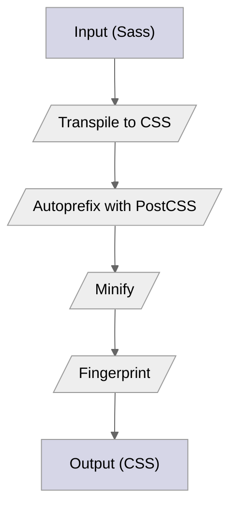

## Introduction

{}

Hugo provides the tools to build fast asset pipelines for these common tasks:

CSS processing
: Bundle, tree shake, minify, create source maps, perform SRI hashing, and integrate with PostCSS.

Image processing
: Convert, resize, crop, rotate, adjust colors, apply filters, overlay text and images, and extract EXIF data.

JavaScript bundling
: Transpile TypeScript and JSX to JavaScript, bundle, tree shake, minify, create source maps, and perform SRI hashing.

Sass processing
: Transpile Sass to CSS, bundle, tree shake, minify, create source maps, perform SRI hashing, and integrate with PostCSS.

Tailwind CSS processing
: Compile Tailwind CSS utility classes into standard CSS, bundle, tree shake, optimize, minify, perform SRI hashing, and integrate with PostCSS.

## Example

This flowchart represents an asset pipeline that converts Sass to CSS, automatically applies vendor prefixes, minifies the output, and creates an SRI hash for security.



## Stages

Asset pipelines have three stages: capture, process, and publish.

### Stage 1 &ndash; Capture

Asset pipelines operate on resources such as images, CSS, Sass, and JavaScript. Each resource is a file, and must be a [global resource](g), a [page resource](g), or a [remote resource](g).

To capture a global resource, use one of these functions:

- [`resources.Get`](/docs/reference/functions/resources/get)
- [`resources.GetMatch`](/docs/reference/functions/resources/getmatch)
- [`resources.Match`](/docs/reference/functions/resources/match)
- [`resources.ByType`](/docs/reference/functions/resources/bytype)

To capture a page resource, use one of these `Page` methods:

- [`Resources.Get`](/docs/reference/methods/page/resources)
- [`Resources.GetMatch`](/docs/reference/methods/page/resources)
- [`Resources.Match`](/docs/reference/methods/page/resources)
- [`Resources.ByType`](/docs/reference/methods/page/resources)

To capture a remote resource, use the [`resources.GetRemote`][] function.

For example, to capture a Sass file in the `assets` directory:

```go-html-template
{{ with resources.Get "main.scss" }}
  ...
{{ end }}
```

### Stage 2 &ndash; Process

After capturing the resource, the next phase is to do something with it.

Let's transpile the Sass file that we captured, minify the output, and create an SRI hash:

```go-html-template
{{ with resources.Get "main.scss" }}
  {{ with . | css.Sass | resources.Minify | resources.Fingerprint }}
    ...
  {{ end }}
{{ end }}
```

### Stage 3 &ndash; Publish

After processing the resource, the last phase is publishing the result to disk using one of these `Resource` methods:

- [`Permalink`](/docs/reference/methods/resource/permalink/)
- [`RelPermalink`](/docs/reference/methods/resource/relpermalink/)
- [`Publish`](docs/reference/methods/resource/publish/)

To complete our example:

```go-html-template
{{ with resources.Get "main.scss" }}
  {{ with . | css.Sass | resources.Minify | resources.Fingerprint }}
    <link rel="stylesheet" href="{{ .RelPermalink }}" integrity="{{ .Data.Integrity }}" crossorigin="anonymous">
  {{ end }}
{{ end }}
```

The call to the `RelPermalink` methods returned the relative permalink and published the CSS file.

## Guides

The preceding example is simplified, excluding error handling and environment-specific behaviors. Detailed guides for various asset pipeline types are provided below.

- [CSS][]
- [Imaging][]
- [JavaScript][]
- [Sass][][]
- [Tailwind CSS][]

## Caching

To optimize performance, Hugo caches [chained pipelines](g), where the output of each operation feeds the next, like this:

```go-html-template
{{ $mainJs := resources.Get "js/main.js" | js.Build "main.js" | minify | fingerprint }}
```

This caching mechanism ensures that pipelines are only executed once per build, preventing performance degradation even in templates used thousands or millions of times.

[CSS]: /docs/guides/asset-pipelines/css/
[Imaging]: /docs/guides/asset-pipelines/imaging/
[JavaScript]: /docs/guides/asset-pipelines/javascript/
[Sass]: /docs/guides/asset-pipelines/sass/
[Tailwind CSS]: /docs/guides/asset-pipelines/tailwind/
[`resources.GetRemote`]: /docs/reference/functions/resources/get
