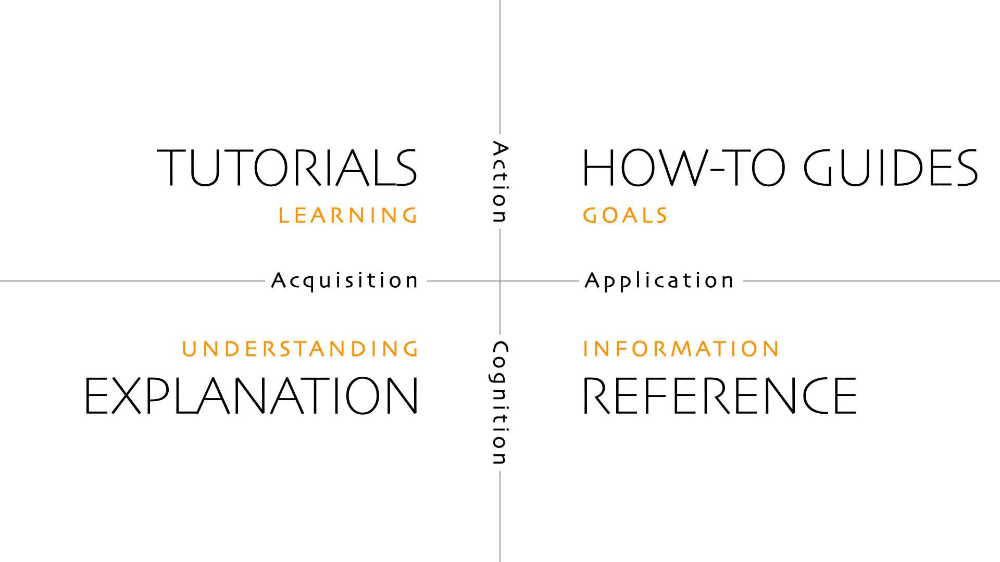

## Introduction

We welcome corrections and improvements to the documentation. The documentation lives in a separate repository from the main project. To contribute:

- For corrections and improvements to existing documentation, submit issues and pull requests to the [documentation repository][].
- For documentation of new features, include the documentation changes in your pull request to the [project repository][].

## Approach

In March 2025 we began transitioning to the [Diátaxis][] documentation model.


{class="border-1 border-gray-300"}

These quadrants match the [Tutorials][], [Guides][], [Concepts][], and [Reference][] sections of this documentation.

The initial phase of the transition was primarily focused on regorganizing existing content rather than rewriting or creating new content. Consequently, some pages may cross quarant boundaries more than expected. This will improve over time.

[The Good Docs Project][] provides a useful, open-source [template repository][] that supports the Diátaxis model:

- [Concept template](https://gitlab.com/tgdp/templates/-/tree/main/concept)
- [Guide template](https://gitlab.com/tgdp/templates/-/tree/main/how-to)
- [Reference template](https://gitlab.com/tgdp/templates/-/tree/main/reference)
- [Tutorial template](https://gitlab.com/tgdp/templates/-/tree/main/tutorial)

## Guidelines

### Style

Follow Google's [developer documentation style guide][] where practical.

### Markdown

Adhere to these Markdown conventions:

- Use [ATX][] headings (levels 2-4), not [setext][] headings.
- Use [collapsed link references][] instead of full or shortcut references. For example:

  ```md {file="content/example.md"}
  This is a [link][].

  [link]: https://example.org
  ```

- Use [inline links][] to link to fragments on the same page. For example:

  ```md {file="content/example.md"}
  This is a link to a [fragment][#fragment].
  ```

- Use [fenced code blocks][] instead of [indented code blocks][].
- Use hyphens, not asterisks, for unordered [list items][].
- Prefix each ordered list item with `1.` instead of numbering the items sequentially.
- Use [callouts](#callouts) instead of bold text for emphasis.
- Do not mix [raw HTML][] within Markdown.
- Do not use bold text in place of a heading or description term (`dt`).
- Remove consecutive blank lines.
- Remove trailing spaces.

### Glossary

[Glossary][] terms are defined on individual pages, providing a central repository for definitions, though these pages are not directly linked from the site.

Definitions must be complete sentences, with the first sentence defining the term. Italicize the first occurrence of the term and any referenced glossary terms for consistency.

Link to glossary terms using this syntax: `[term](g)`

Term lookups are case-insensitive, ignore formatting, and support singular and plural forms. For example, all of these variations will link to the same glossary term:

```md {file="content/example.md"}
[global resource](g)
[Global Resource](g)
[Global Resources](g)
[`Global Resources`](g)
```

Use the [glossary-term shortcode](#glossary-term) to insert a term definition:

```md {file="content/example.md"}
{}
```

### Terminology

Link to the [glossary][] as needed and use terms consistently. Pay particular attention to:

- "client side" (noun), "client-side" (adjective)
- "file name" (two words)
- "flag" (instead of "option" for command-line flags)
- "front matter" (two words, except when referring to the configuration key)
- "home page" (two words)
- "map" (instead of "dictionary")
- "Markdown" (capitalized)
- "open source" (noun), "open-source" (adjective)
- "server side" (noun), "server-side" (adjective)
- "standalone" (noun or adjective)
- "stylesheet" (one word)
- "website" (one word)

### Template types

When you refer to a template type, italicize it:

```md {file="content/example.md"}
When creating a _taxonomy_ template, do this...
```

However, if the template type is also a link, do not italicize it to avoid distracting formatting:

```md {file="content/example.md"}
When creating a [taxonomy][] template, do this...
```

Do not italicize the template type in a title, heading, or front matter description.

### Titles and headings

- Use sentence-style capitalization.
- Avoid formatted strings.
- Keep them concise.

### Page descriptions

When writing the page `description` use imperative present tense when possible. For example:


title: Data functions
linkTitle: data
description: Use these functions to read local or remote data files.


### Writing style

Prefer active voice and present tense.

No → With Hugo you can build a static site.\
Yes → Build a static site with Hugo.

No → This will cause Hugo to generate HTML files in the `public` directory.\
Yes → Hugo generates HTML files in the `public` directory.

Use second person instead of third person.

No → Users should exercise caution when deleting files.\
Better → You must be cautious when deleting files.\
Best → Be cautious when deleting files.

Minimize adverbs.

No → Hugo is extremely fast.\
Yes → Hugo is fast.

> [!note]
> "It's an adverb, Sam. It's a lazy tool of a weak mind." (Outbreak, 1995).

### Function and method descriptions

Start descriptions in the functions and methods sections with "Returns", or for booelan values, "Reports whether".

### File paths and names

Enclose directory names, file names, and file paths in backticks, except when used in:

- Page titles
- Section headings (`h1`-`h6`)
- Definition list terms
- The `description` field in front matter

### Miscellaneous

Other best practices:

- Introduce lists with a sentence or phrase, not directly under a heading.
- Do not put description terms (`dt`) in backticks unless syntactically necessary.
- Do not use Hugo's `ref` or `relref` shortcodes.
- Prioritize current best practices over multiple options or historical information.
- Use short, focused code examples.
- Use [basic english][] where possible for a global audience.

## Front matter fields

This site uses the front matter fields listed in the table below.

Of the four required fields, only `title` and `description` require data.


title: The title
description: The description
categories: []
keywords: []


If quotation marks are required, prefer single quotes to double quotes when possible.

Field|Description|Required
:--|:--|:--
`title`|The page title|:heavy_check_mark:
`linkTitle`|A short version of the page title|&nbsp;
`description`|A complete sentence describing the page|:heavy_check_mark:
`categories`|An array of terms in the categories taxonomy|:heavy_check_mark: [^1]
`keywords`|An array of keywords used to identify related content|:heavy_check_mark: [^1]
`publishDate`|Applicable to news items: the publication date|&nbsp;
`params.alt_title`|An alternate title: used in the "see also" panel if provided|&nbsp;
`params.functions_and_methods.aliases`|Applicable to function and method pages: an array of alias names|&nbsp;
`params.functions_and_methods.returnType`|Applicable to function and method pages: the data type returned|&nbsp;
`params.functions_and_methods.signatures`|Applicable to function and method pages: an array of signatures|&nbsp;
`params.label`|Applicable to second-level section pages such as concepts, guides, references, and tutorials: a lowercase 3-letter code to identify the section, used in the `related` partial|&nbsp;
`params.hide_in_this_section`|Whether to hide the "in this section" panel|&nbsp;
`params.minversion`|Applicable to the quick start page: the minimum Hugo version required|&nbsp;
`params.permalink`|Reserved for use by the news content adapter|&nbsp;
`params.reference (used in glossary term)`|Applicable to glossary entries: a URL for additional information|&nbsp;
`params.searchable`|Whether to add the content of this page to the search index. The default value is cascaded down from the project configuration; `true` if the page kind is `page`, and `false` if the page kind is one of `home`, `section`, `taxonomy`, or `term`. Add this field to override the default value.|&nbsp;
`params.show_publish_date`|Whether to show the `publishDate` when rendering the page|&nbsp;
`weight`|The page weight|&nbsp;
`aliases`|Previous URLs used to access this page|&nbsp;
`expirydate`|The expiration date|&nbsp;

[^1]: The field is required, but its data is not.

## Related content

When available, the "See also" sidebar displays related pages using Hugo's [related content][] feature, based on front matter keywords. We ensure consistent keyword usage by validating them against `data/keywords.yaml` during the build. If a keyword is not found, you'll be alerted and must either modify the keyword or update the data file. This validation process helps to refine the related content for better results.

If the title in the "See also" sidebar is ambiguous or the same as another page, you can define an alternate title in the front matter:


title = "Long descriptive title"
linkTitle = "Short title"
[params]
alt_title = "Whatever you want"


Use of the alternate title is limited to the "See also" sidebar.

> [!note]
> Think carefully before setting the `alt_title`. Use it only when necessary.

## Code examples

With examples of template code:

- Indent with two spaces.
- Insert a space after an opening action delimiter.
- Insert a space before a closing action delimiter.
- Do not add white space removal syntax to action delimiters unless required. For example, inline elements like `img` and `a` require whitespace removal on both sides.

````text {file="content/example.md"}
```go-html-template
{{ if eq $foo $bar }}
  {{ fmt.Printf "%s is %s" $foo $bar }}
{{ end }}
```
````

### Fenced code blocks

Always specify the language.

````text {file="content/example.md"}
```go-html-template
{{ if eq $foo "bar" }}
  {{ print "foo is bar" }}
{{ end }}
```
````

Set the language to `sh` when including command line examples:

````text {file="content/example.md"}
```sh
hugo server -D
```
````

> [!note]
> The code block render hook substitutes `bash`, `ksh`, `sh`, `shell`, or `zsh` with `text` in fenced blocks. They will display without syntax highlighting to ensure a clearer presentation.

Set the language to `tree` when documenting the output of the `tree` command:

````text {file="content/example.md"}
```tree
assets/
└── images/
    └── sunset.jpg
```
````

> [!note]
> The code block render hook substitutes `tree` with `text` because we lack a dedicated `tree` syntax lexer. Despite this, we explicitly set the language to `tree` in fenced blocks so we can easily search for these specific examples within the Markdown source files.

To include a file name header and copy-to-clipboard button:

````text {file="content/example.md"}
```go-html-template {file="layouts/_partials/foo.html" copy=true}
{{ if eq $foo "bar" }}
  {{ print "foo is bar" }}
{{ end }}
```
````

To wrap the code block within an initially-opened `details` element using a non-default summary:

````text {file="content/example.md"}
```go-html-template {details=true open=true summary="layouts/_partials/foo.html" copy=true}
{{ if eq $foo "bar" }}
  {{ print "foo is bar" }}
{{ end }}
```
````

Whitespace trimming is enabled by default. To override this behavior and preserve leading and trailing whitespace:

````text {file="content/example.md"}
```go-html-template {trim=false}

{{ if eq $foo "bar" }}
  {{ print "foo is bar" }}
{{ end }}

```
````

### Shortcode calls

Use this syntax to escape the call within examples:

```md {file="content/example.md"}

{}
```

### Project configuration

Use the [code-toggle shortcode](#code-toggle) to include project configuration examples:

```md {file="content/example.md"}

baseURL = 'https://example.org/'
languageCode = 'en-US'
title = 'My Site'

```

### Front matter

Use the [code-toggle shortcode](#code-toggle) to include front matter example, setting the `fm` attribute to `true`:

```md {file="content/example.md"}

title = 'My first post'
date = 2023-11-09T12:56:07-08:00
draft = false

```

## Callouts

Use callouts (admonitions) to visually emphasize important information.

There are five callout types: `note`, `important`, `tip`, `warning`, and `caution`. These are the usage statistic as of 5 Oct 2025, including usage on this page:

- note (279)
- tip (3)
- important (6)
- warning (5)
- caution (5)

The predominant use of the `note` callout type is a historical artifact; the previous theme only provided a "note" shortcode, so the callouts were generic.

In the examples below, the callout type (e.g., `note`, `warning`) is case-insensitive.

```md {file="content/example.md"}
> [!note]
> Useful information that users should know, even when skimming content.
```

> [!note]
> Useful information that users should know, even when skimming content.

```md {file="content/example.md"}
> [!important]
> Key information users need to know to achieve their goal.
```

> [!important]
> Key information users need to know to achieve their goal.

```md {file="content/example.md"}
> [!tip]
> Helpful advice for doing things better or more easily.
```

> [!tip]
> Helpful advice for doing things better or more easily.

```md {file="content/example.md"}
> [!warning]
> Urgent info that needs immediate user attention to avoid problems.
```

> [!warning]
> Urgent info that needs immediate user attention to avoid problems.

```md {file="content/example.md"}
> [!caution]
> Advises about risks or negative outcomes of certain actions.
```

> [!caution]
> Advises about risks or negative outcomes of certain actions.

## Shortcodes

These shortcodes are commonly used throughout the documentation. Other shortcodes are available for specialized use.

### code-toggle

Use the `code-toggle` shortcode to display examples of project configuration, front matter, or data files. This shortcode takes these arguments:

config
: (`string`) The section of `hugo.Data.docs.config` to render.

copy
: (`bool`) Whether to display a copy-to-clipboard button. Default is `false`.

datakey:
: (`string`) The section of `hugo.Data.docs` to render.

file
: (`string`) The file name to display above the rendered code. Omit the file extension for project configuration examples.

fm
: (`bool`) Whether to render the code as front matter. Default is `false`.

skipHeader
: (`bool`) Whether to omit top-level key(s) when rendering a section of `hugo.Data.docs.config`.

```md {file="content/example.md"}

baseURL = 'https://example.org/'
languageCode = 'en-US'
title = 'My Site'

```

### deprecated-in

Use the `deprecated-in` shortcode to indicate that a feature is deprecated:

```md {file="content/example.md"}


Use [`hugo.IsServer`][] instead.

[`hugo.IsServer`]: /functions/hugo/isserver/

```

### eturl

Use the embedded template URL (`eturl`) shortcode to insert an absolute URL to the source code for an embedded template. The shortcode takes a single argument, the base file name of the template (omit the file extension).

```md {file="content/example.md"}
This is a link to the [embedded alias template][].

[embedded alias template]: <{}>
```

### glossary-term

Use the `glossary-term` shortcode to insert the definition of the given glossary term.

```md {file="content/example.md"}
{}
```

### include

Use the `include` shortcode to include content from another page.

```md {file="content/example.md"}
{}
```

### new-in

Use the `new-in` shortcode to indicate a new feature:

```md {file="content/example.md"}

```

You can also include details:

```md {file="content/example.md"}

This is a new feature.

```

## New features

Use the [new-in shortcode](#new-in) to indicate a new feature:

```md {file="content/example.md"}

```

The "new in" label will be hidden if the specified version is older than a predefined threshold, based on differences in major and minor versions. See&nbsp;[details](https://github.com/gohugoio/hugoDocs/blob/master/layouts/_shortcodes/new-in.html).

## Deprecated features

Use the [deprecated-in shorcode](#deprecated-in) shortcode to indicate that a feature is deprecated:

```md {file="content/example.md"}

Use [`hugo.IsServer`][] instead.

[`hugo.IsServer`]: /functions/hugo/isserver/

```

When deprecating a function or method, add something like this to front matter:


expiryDate: 2027-02-17 # deprecated 2025-02-17 in v0.144.0


Set the `expiryDate` to two years from the date of deprecation, and add a brief front matter comment to explain the setting.

## GitHub workflow

> [!note]
> This section assumes that you have a working knowledge of Git and GitHub, and are comfortable working on the command line.

Use this workflow to create and submit pull requests.

Step 1
: Fork the [documentation repository][].

Step 2
: Clone your fork.

Step 3
: Create a new branch with a descriptive name that includes the corresponding issue number, if any:

  ```sh
  git checkout -b restructure-foo-page-99999
  ```

Step 4
: Make changes.

Step 5
: Build the site locally to preview your changes.

Step 6
: Commit your changes with a descriptive commit message:

  - Provide a summary on the first line, typically 50 characters or less, followed by a blank line.
    - Begin the summary with one of `content`, `theme`, `config`, `all`, or `misc`, followed by a colon, a space, and a brief description of the change beginning with a capital letter
    - Use imperative present tense
  - Optionally, provide a detailed description where each line is 72 characters or less, followed by a blank line.
  - Optionally, add one or more "Fixes" or "Closes" keywords, each on its own line, referencing the [issues][] addressed by this change.

  For example:

  ```sh
  git commit -m "content: Restructure the taxonomy page

  This restructures the taxonomy page by splitting topics into logical
  sections, each with one or more examples.

  Fixes #9999
  Closes #9998"
  ```

Step 7
: Push the new branch to your fork of the documentation repository.

Step 8
: Visit the [documentation repository][] and create a pull request (PR).

Step 9
: A project maintainer will review your PR and may request changes. You may delete your branch after the maintainer merges your PR.

[ATX]: https://spec.commonmark.org/current/#atx-headings
[basic english]: https://simple.wikipedia.org/wiki/Basic_English
[collapsed link references]: https://discourse.gohugo.io/t/55714
[Concepts]: /docs/concepts
[developer documentation style guide]: https://developers.google.com/style
[Diátaxis]: https://diataxis.fr
[documentation repository]: https://github.com/gohugoio/hugoDocs/
[fenced code blocks]: https://spec.commonmark.org/current/#fenced-code-blocks
[glossary]: /docs/glossary/
[Guides]: /docs/guides
[indented code blocks]: https://spec.commonmark.org/current/#indented-code-blocks
[inline links]: https://discourse.gohugo.io/t/55714
[issues]: https://github.com/gohugoio/hugoDocs/issues
[list items]: https://spec.commonmark.org/current/#list-items
[project repository]: https://github.com/gohugoio/hugo
[raw HTML]: https://spec.commonmark.org/current/#raw-html
[Reference]: /docs/reference
[related content]: /content-management/related-content/
[setext]: https://spec.commonmark.org/current/#setext-heading
[template repository]: https://gitlab.com/tgdp/templates/-/tree/main
[The Good Docs Project]: https://www.thegooddocsproject.dev/
[Tutorials]: /docs/tutorials
